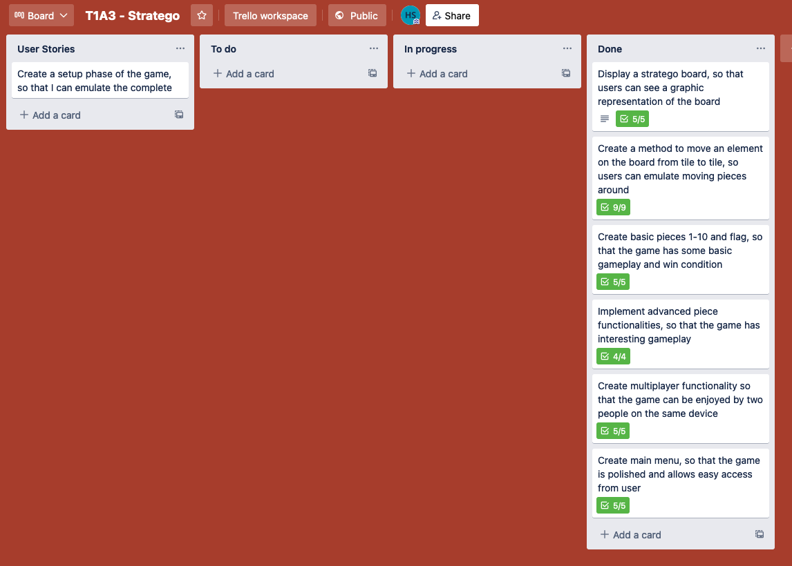
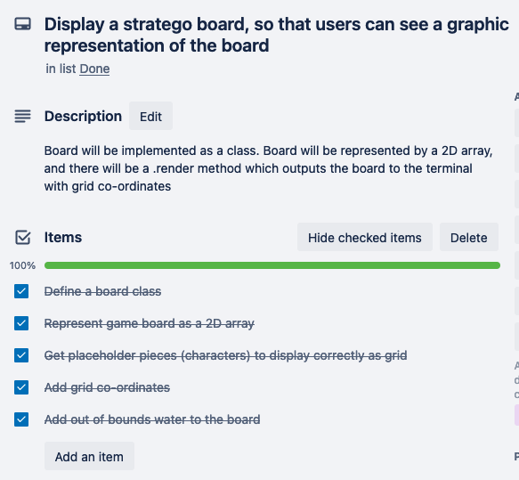
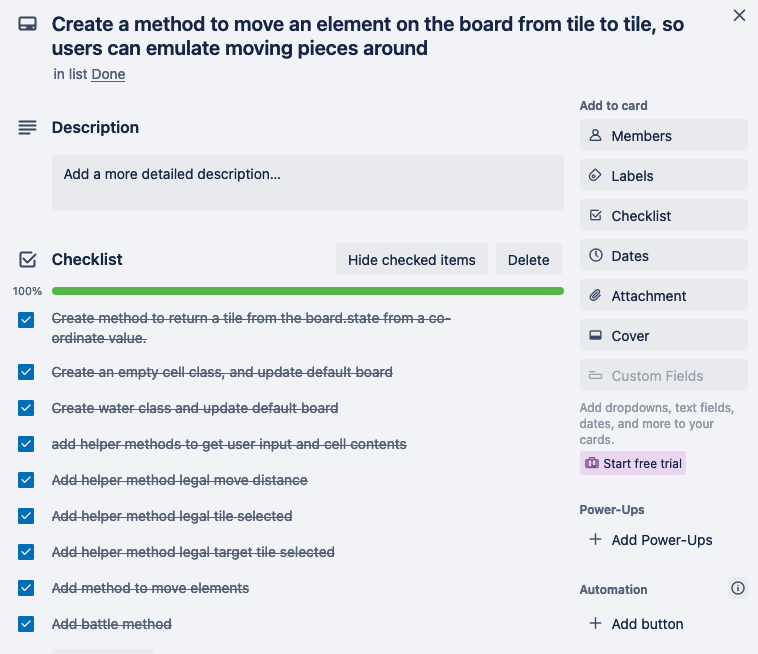
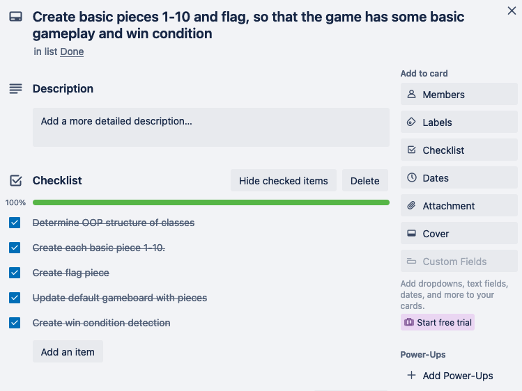
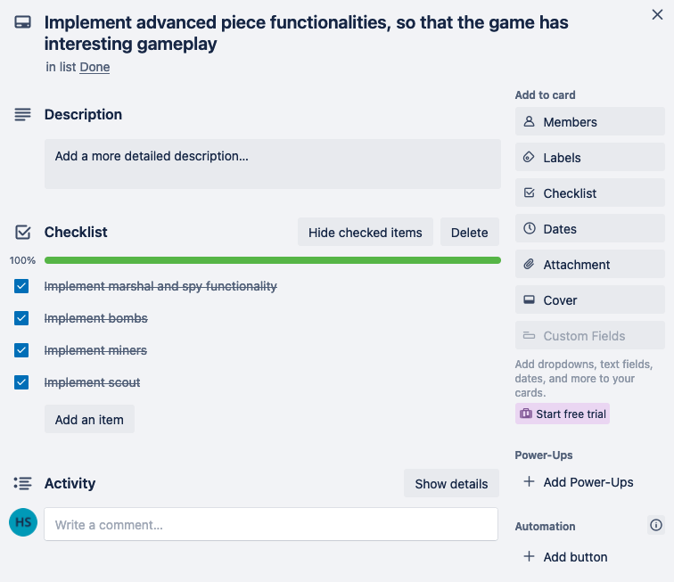
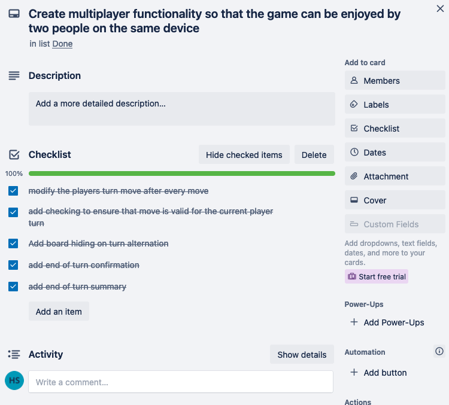
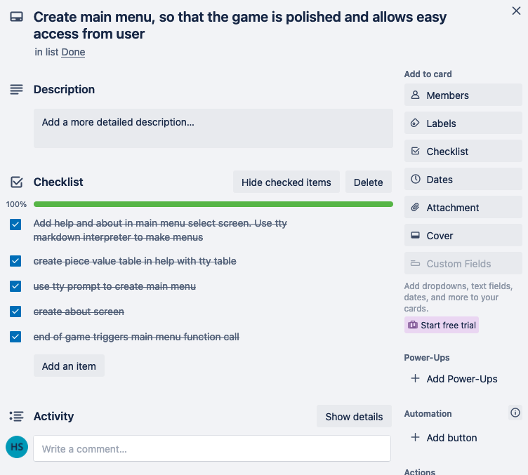

# T1A3 Henry Stevens: Stratego

## Repo

[Available on github](https://github.com/rhynecs/stratego)

## Code style guide

Code will attempt to follow the style conventions outlines in the [Ruby Style Guide](https://rubystyle.guide/)

## Features

### Graphic representation of stratego board
- Displayed as a 2D grid with each piece represented as a character
- Axis on all sides of the grid to make identifying the correct cell easy
- Game board updates on start of new turn
- Different colors make identifying pieces easier
- Implemented with gem 'Rainbow'

### Piece selection and movement via text input of grid coordinate values
- Users can type coordinate commands like 'a3 a4'
  - a3 selects a piece
  - a4 selects where to move / attack
- Commands are validated to ensure correct syntax and legality

### All traditional stratego pieces are emulated
- Capturing flag wins the game
- Bombs destroy all units except the miner (8)
- The spy can kill the marshall if it attacks first (S)
- The scout can move any number of tiles in one direction and attack on the same turn
  - Cannot 'hop' over any pieces
- All other pieces function as intended and can battle and attack each other correctly

### Multiplayer functionality
- Game alternates player turn after every move
- Enemy squares are hidden to maintain 'fog of war'
  - 'openboard' as an ARGV disables this square hiding
- There is a waiting screen before moves to allow users to hand over control to the other player
  - Prevents cheating / peaking at enemy setup
  - Shows the turn entered and any battle outcome
- Capturing flag triggers win message and returns to menu

### Menu system
- Main menu contains play, help and about option
- Fully navigatable
- Buttons implemented with TTY-prompt
- Help menus implemented with TTY-markdown and TTY-table

## Implementation plan

Kanban board available at [Trello](https://trello.com/b/NukWEPam/t1a3-stratego)

Screenshots of board:

## Help Documentation

### Installing the app

**Running the app**
1) Open terminal
2) Use the cd (change directory) command to navigate to within the /src/ folder
3) Type ./run_app.sh to play

**Using the app**
- Main menus can be navigated by arrow keys (up/down) and enter to confirm choice
- Once in game, enter two grid coordinates seperated by a space to move pieces.
  - First-coordinate second-coordinate
  - a3 a4
  - b6 b4
  - a4 a5
  - etc
- Refer to help menu for game rules
- App accepts openboard as and ARGV, and disables board hiding / fog of war.
